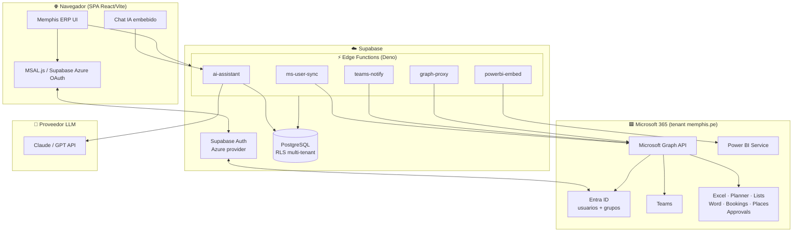
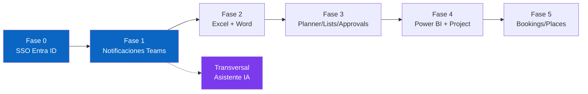
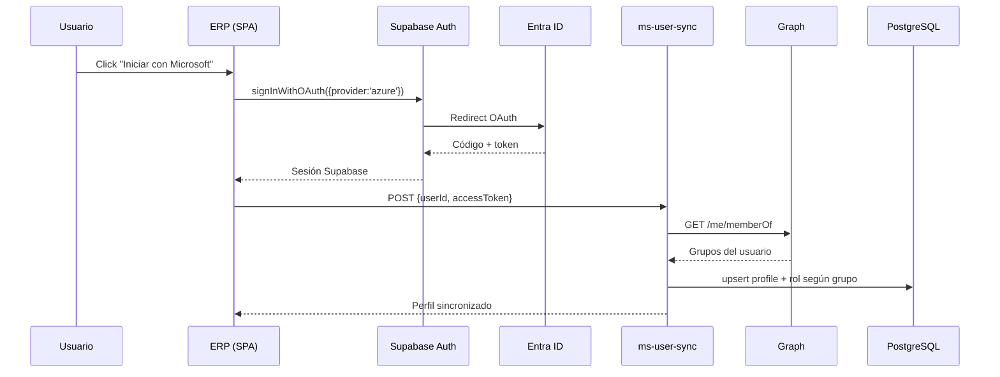
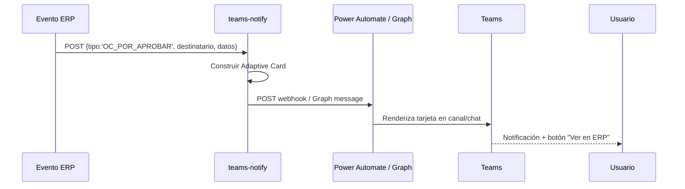
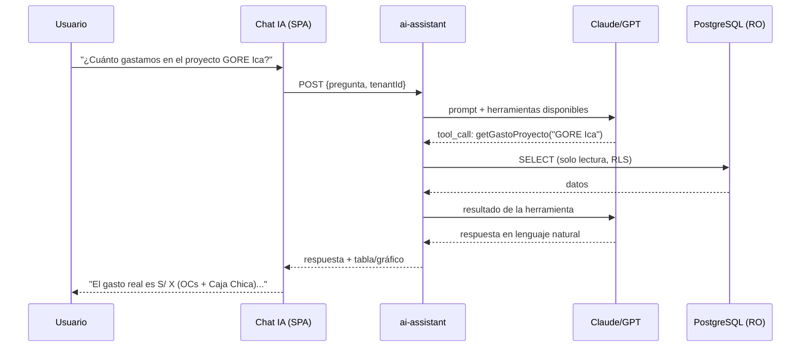

# Arquitectura de Integración Memphis ERP ↔ Microsoft 365

> **Estado:** Propuesta de arquitectura (v1.0 — 2026-05-28)
> **Autor:** Equipo de desarrollo Memphis ERP
> **Tenant Microsoft:** `memphis.pe` · Administrador: `kcastillo@memphis.pe`
> **Alcance:** SSO con Entra ID, notificaciones por Teams, e integración progresiva con el ecosistema M365 (Excel, Planner, Lists, Power BI, Word, Approvals, Bookings, Places, Copilot) + asistente IA del sistema.

---

## 1. Objetivo

Convertir el Memphis ERP en una pieza **nativa del ecosistema Microsoft 365** que usa el equipo, de modo que:

1. Los usuarios entren con su **cuenta corporativa** (`@memphis.pe`) — sin contraseñas separadas.
2. Los **roles y permisos** se gobiernen desde los **grupos de Entra ID** (altas/bajas centralizadas).
3. Las **notificaciones** del ERP (OTs vencidas, OCs por aprobar, mantenimientos próximos, presupuestos en riesgo) lleguen por **Teams**.
4. El ERP intercambie datos con **Excel, Planner, Lists, Word, Power BI, Approvals, Bookings y Places**.
5. Exista un **asistente IA** que responda preguntas sobre los datos del sistema y genere reportes.

---

## 2. Diagnóstico del estado actual (2026-05-28)

| Componente | Estado | Evidencia en código |
|---|---|---|
| Autenticación | Supabase email + password | `src/auth/AuthProvider.tsx` → `signInWithPassword` |
| Botón "Microsoft" en login | **Deshabilitado** (placeholder) | `src/components/auth/Login.tsx:154` → `<Button disabled>Microsoft</Button>` |
| Entra ID / Azure AD / MSAL / OAuth | **No existe** | — |
| Notificaciones (Teams/email/push) | **No existe** infraestructura | — |
| Edge Functions | Solo `gps-sync`, `sunat-proxy` | `supabase/functions/` |
| RBAC (roles/permisos) | Funcional pero aislado de M365 | `src/lib/rbac/roles-store`, `GestionUsuarios.tsx` |
| Bot / IA | **No existe** | — |

**Conclusión:** la gestión de usuarios/roles funciona internamente, pero no hay ningún puente con Microsoft 365. Esta arquitectura construye ese puente desde cero.

---

## 3. Restricción arquitectónica fundamental

El sistema es una **SPA pura de React (Vite)** — no hay servidor backend propio, solo **Supabase + Edge Functions (Deno)**.

**Implicación crítica de seguridad:**

> El navegador **NUNCA** debe almacenar secretos (client secrets de Azure, tokens de aplicación de Graph). Toda llamada a Microsoft Graph que requiera credenciales de aplicación **debe pasar por una Edge Function** que custodie el secreto.

Patrón obligatorio para toda integración:

```
SPA (navegador)  →  Supabase Edge Function (custodia el secret)  →  Microsoft Graph API  →  respuesta
```

Este patrón ya está probado en el proyecto con `sunat-proxy`.

---

## 4. Arquitectura objetivo (vista general)



---

## 5. Microsoft Graph: la API central

Casi todo M365 se accede por **una sola API** (Microsoft Graph), lo que simplifica enormemente la estrategia. Power BI y Project son las dos excepciones (APIs propias).

| Herramienta | Capacidad para el ERP | API | Permisos Graph típicos |
|---|---|---|---|
| **Entra ID** | Login SSO, leer grupos→roles | Graph | `User.Read`, `GroupMember.Read.All` |
| **Teams** | Enviar notificaciones (canal/chat) | Graph | `ChannelMessage.Send`, `Chat.ReadWrite` |
| **Excel** | Exportar reportes, leer datos | Graph (Workbook) | `Files.ReadWrite` |
| **Planner** | Crear/sincronizar tareas | Graph | `Tasks.ReadWrite` |
| **Lists / SharePoint** | Leer/escribir items | Graph | `Sites.ReadWrite.All` |
| **Word** | Generar documentos (OC, contratos) | Graph + plantillas | `Files.ReadWrite` |
| **Approvals** | Flujos de aprobación en Teams | Graph + Power Automate | (vía flujo) |
| **Bookings** | Reservas | Graph | `Bookings.ReadWrite.All` |
| **Places** | Salas/recursos | Graph | `Place.Read.All` |
| **Power BI** | Dashboards embebidos | **Power BI REST** (API aparte) | Power BI service principal |
| **Project** | Cronogramas (Project for the Web) | **Dataverse** (API aparte) | Dataverse — el más complejo |
| **Copilot** | Asistente sobre datos del ERP | Copilot Studio / agente propio | (ver §10) |

---

## 6. Matriz de licencias M365 (a completar)

> **Fuente:** [SharePoint List — Distribución de licencias (sitio TI)](https://memphisperu.sharepoint.com/:l:/s/TI/JADkqEpG56GRTZ4tUHHuC5jdAZCQCsLkje2wUevHZ3rjdOo)
>
> _Esta lista es un SharePoint List y debe completarse manualmente con los datos reales. Las funcionalidades del roadmap dependen de las licencias disponibles:_

| Funcionalidad ERP | Licencia requerida | Notas |
|---|---|---|
| SSO Entra ID | Cualquier licencia M365/Entra ID | Incluido en todas las licencias |
| Notificaciones Teams | M365 con Teams | Estándar |
| Excel / Word / Planner / Lists | M365 Business/E3/E5 | Estándar |
| Approvals | Power Automate (incluido en M365) | Estándar |
| Bookings | M365 Business Standard+ / E3 / E5 | Verificar plan |
| **Power BI Embedded** | Power BI Pro o capacidad PBI Embedded | **Verificar — costo adicional** |
| **M365 Copilot** | Licencia Copilot ($30/usuario/mes aprox.) | **Verificar — costo adicional** |
| **Project for the Web** | Project Plan 1/3/5 | **Verificar — costo adicional** |

**Acción pendiente:** completar esta tabla con el conteo real de licencias por tipo desde la lista de SharePoint para confirmar qué fases del roadmap son viables sin compra adicional.

---

## 7. Roadmap por fases



| Fase | Entregable | Dependencias | Prioridad |
|---|---|---|---|
| **0** | SSO con Entra ID (login corporativo + roles desde grupos) | App registrada en Azure | **Crítica — habilita todo** |
| **1** | Notificaciones por Teams | Fase 0 | **Crítica — pedido del negocio** |
| 2 | Exportar a Excel / generar Word | Fase 0 | Alta |
| 3 | Planner / Lists / Approvals | Fase 0 | Media |
| 4 | Power BI embebido / Project | Licencias | Media |
| 5 | Bookings / Places | Licencias | Baja |
| IA | Asistente embebido (transversal) | — | Alta |

---

## 8. Detalle técnico — Edge Functions

Todas las Edge Functions viven en `supabase/functions/` (runtime Deno) y siguen el patrón de `sunat-proxy`. Los secretos se configuran con `supabase secrets set`.

### 8.1 — `ms-user-sync` (Fase 0)

**Propósito:** sincronizar usuarios y mapear grupos de Entra ID → roles del ERP.

| Atributo | Valor |
|---|---|
| Trigger | Al login (post-OAuth) y/o cron diario |
| Entrada | `{ userId, accessToken }` |
| Graph endpoints | `GET /me`, `GET /me/memberOf` |
| Secretos | `MS_TENANT_ID`, `MS_CLIENT_ID`, `MS_CLIENT_SECRET` |
| Salida | upsert en `profiles` + asignación de `rol_id` según mapeo grupo→rol |



**Mapeo grupo→rol** (tabla de configuración nueva, `ms_group_role_map`):

| Grupo Entra ID | Rol ERP |
|---|---|
| `Gerencia` | `admin` |
| `Compras` | `comprador` |
| `Flota-Operaciones` | `operador_flota` |
| `Biomédico` | `tecnico_biomedico` |
| `Finanzas` | `finanzas` |

---

### 8.2 — `teams-notify` (Fase 1)

**Propósito:** enviar notificaciones del ERP a Teams (canal o chat directo) usando **Adaptive Cards**.

| Atributo | Valor |
|---|---|
| Trigger | Eventos del ERP (DB triggers / llamada desde SPA / cron) |
| Entrada | `{ tipo, destinatario, titulo, cuerpo, accionUrl, datos }` |
| Mecanismo MVP | **Power Automate Workflow** (webhook entrante) — sin permisos de Graph |
| Mecanismo robusto | Graph `POST /teams/{id}/channels/{id}/messages` o `POST /chats/{id}/messages` |
| Secretos | `TEAMS_WEBHOOK_URL` (MVP) o `MS_CLIENT_SECRET` (Graph) |



**Catálogo de eventos notificables (inicial):**

| Evento | Origen módulo | Destinatario |
|---|---|---|
| OT vencida / próxima a vencer | Flota | Responsable flota |
| OC pendiente de aprobación | Compras | Aprobador |
| Mantenimiento biomédico próximo | Biomédico | Técnico asignado |
| Presupuesto de proyecto al ≥90% | Proyectos/Finanzas | Gerente proyecto |
| Documento de vehículo por vencer (SOAT, rev. técnica) | Flota | Responsable flota |
| Calibración de equipo vencida | Biomédico | Técnico biomédico |

**Estrategia recomendada:** arrancar con **Power Automate Workflow** (no requiere permisos de Graph ni client secret; el admin crea un flujo "When a Teams webhook request is received"), y migrar a Graph cuando se necesiten mensajes dirigidos por usuario individual.

---

### 8.3 — `graph-proxy` (Fases 2-3-5)

**Propósito:** proxy genérico autenticado hacia Microsoft Graph para Excel, Word, Planner, Lists, Bookings, Places.

| Atributo | Valor |
|---|---|
| Entrada | `{ method, endpoint, body, userToken }` |
| Auth | On-Behalf-Of flow (token de usuario) o app-only según operación |
| Secretos | `MS_TENANT_ID`, `MS_CLIENT_ID`, `MS_CLIENT_SECRET` |
| Validación | Allowlist de endpoints permitidos (evitar SSRF) |

> **Nota de seguridad:** este proxy debe validar contra una **allowlist de endpoints** de Graph. Nunca reenviar URLs arbitrarias provistas por el cliente.

---

### 8.4 — `powerbi-embed` (Fase 4)

**Propósito:** generar el embed token para incrustar dashboards de Power BI en el módulo BI del ERP.

| Atributo | Valor |
|---|---|
| Entrada | `{ reportId, workspaceId }` |
| API | Power BI REST (`POST /reports/{id}/GenerateToken`) |
| Auth | Service principal de Power BI |
| Secretos | `PBI_CLIENT_ID`, `PBI_CLIENT_SECRET`, `PBI_TENANT_ID` |

---

### 8.5 — `ai-assistant` (Transversal)

**Propósito:** backend del asistente IA. Recibe preguntas en lenguaje natural, consulta datos del ERP (solo lectura) y responde / genera reportes.

| Atributo | Valor |
|---|---|
| Entrada | `{ pregunta, contexto, tenantId }` |
| LLM | Claude / GPT API |
| Acceso a datos | Consultas SQL de **solo lectura** parametrizadas + RLS por tenant |
| Secretos | `LLM_API_KEY` |
| Patrón | Tool-calling: el LLM elige funciones predefinidas (ej. `getGastoProyecto`, `getEstadoFlota`) — nunca SQL libre |



> **Seguridad clave:** el LLM **nunca** ejecuta SQL arbitrario. Solo invoca un conjunto cerrado de funciones de solo-lectura que respetan RLS multi-tenant. Esto previene fuga de datos entre tenants e inyección.

---

## 9. Fase 0 detallada — SSO con Entra ID

### 9.1 — Prerrequisitos (los hace el admin `kcastillo@memphis.pe`)

1. **Registrar App en Entra ID** (Azure Portal → App registrations):
   - Nombre: `Memphis ERP`
   - Redirect URI: `https://<proyecto>.supabase.co/auth/v1/callback`
   - Tipo: Web
2. Crear **client secret** y guardarlo.
3. Permisos de API (Graph, delegados): `User.Read`, `GroupMember.Read.All` → **conceder consentimiento de admin**.
4. En **Supabase Dashboard → Authentication → Providers → Azure**: pegar Client ID, Secret, Tenant URL.

### 9.2 — Cambios en código (los hace el desarrollador)

| Archivo | Cambio |
|---|---|
| `src/auth/AuthProvider.tsx` | Agregar `signInWithAzure()` → `supabase.auth.signInWithOAuth({ provider: 'azure', options: { scopes: 'email profile openid User.Read GroupMember.Read.All' } })` |
| `src/components/auth/Login.tsx` | Habilitar el botón "Microsoft" → llamar `signInWithAzure()` |
| `supabase/functions/ms-user-sync/` | **Nueva** Edge Function (mapeo grupo→rol) |
| `supabase/migrations/` | **Nueva** tabla `ms_group_role_map` |

### 9.3 — Variables de entorno / secretos

```bash
# Supabase secrets (Edge Functions)
supabase secrets set MS_TENANT_ID=<tenant-id-memphis.pe>
supabase secrets set MS_CLIENT_ID=<app-client-id>
supabase secrets set MS_CLIENT_SECRET=<app-secret>
```

> El Client ID/Secret de Azure se configuran en el **Supabase Dashboard** (provider Azure), NO en el `.env` del frontend.

---

## 10. Fase 1 detallada — Notificaciones por Teams

### 10.1 — Camino MVP (recomendado para arrancar) — Power Automate

1. El admin crea un **Flujo de Power Automate**: trigger "When a Teams webhook request is received".
2. El flujo recibe el JSON del ERP y publica una **Adaptive Card** en el canal/chat destino.
3. El ERP solo necesita la **URL del webhook** (un secreto, sin permisos de Graph).

```bash
supabase secrets set TEAMS_WEBHOOK_URL=<url-del-flujo-power-automate>
```

**Ventaja:** cero configuración de permisos de Graph, implementable de inmediato.

### 10.2 — Camino robusto (escala) — Graph API

- Permisos de aplicación: `ChannelMessage.Send`, `Chat.ReadWrite`.
- Mensajes dirigidos a usuarios individuales por su email/ID de Entra.
- Requiere consentimiento de admin y custodia del client secret en la Edge Function.

### 10.3 — Cambios en código

| Archivo | Cambio |
|---|---|
| `supabase/functions/teams-notify/` | **Nueva** Edge Function |
| `src/lib/notificaciones/notif-service.ts` | **Nuevo** — helper que llama a `teams-notify` |
| Stores existentes (OT, OC, mantenimientos) | Disparar `notif-service` en eventos clave |
| `supabase/migrations/` | **Nueva** tabla `notificaciones_log` (auditoría de envíos) |

---

## 11. Consideraciones de seguridad

1. **Secretos solo en Edge Functions** — jamás en el bundle del frontend.
2. **RLS multi-tenant** se mantiene en todas las consultas, incluido el asistente IA.
3. **Allowlist de endpoints** en `graph-proxy` para prevenir SSRF.
4. **El asistente IA usa tool-calling cerrado**, nunca SQL libre.
5. **Consentimiento de admin** requerido para permisos de Graph — lo otorga `kcastillo@memphis.pe`.
6. **Auditoría:** registrar envíos de notificaciones y accesos del asistente IA.
7. **Tokens de usuario** (OAuth) tienen alcance mínimo (least privilege).

---

## 12. Resumen de artefactos nuevos

### Edge Functions (Supabase)
| Función | Fase | Estado |
|---|---|---|
| `ms-user-sync` | 0 | Pendiente |
| `teams-notify` | 1 | Pendiente |
| `graph-proxy` | 2-3-5 | Futuro |
| `powerbi-embed` | 4 | Futuro |
| `ai-assistant` | Transversal | Futuro |

### Tablas nuevas (PostgreSQL)
| Tabla | Fase | Propósito |
|---|---|---|
| `ms_group_role_map` | 0 | Mapeo grupo Entra ID → rol ERP |
| `notificaciones_log` | 1 | Auditoría de notificaciones enviadas |

### Frontend
| Archivo | Fase | Cambio |
|---|---|---|
| `AuthProvider.tsx` | 0 | `signInWithAzure()` |
| `Login.tsx` | 0 | Habilitar botón Microsoft |
| `notif-service.ts` | 1 | Nuevo helper de notificaciones |
| Chat IA embebido | IA | Nuevo componente |

---

## 13. Decisiones / prerrequisitos pendientes

- [ ] **Completar matriz de licencias** (§6) desde la lista de SharePoint para confirmar viabilidad de Power BI, Copilot y Project.
- [ ] **Admin registra la App en Entra ID** y otorga consentimiento (Fase 0).
- [ ] **Admin crea el Flujo de Power Automate** para Teams (Fase 1, camino MVP).
- [ ] **Definir el mapeo grupo→rol** definitivo (§8.1) con los grupos reales de Entra ID.
- [ ] **Elegir proveedor LLM** para el asistente IA (Claude vs GPT) y presupuesto.
- [ ] **Confirmar canales/chats de Teams** destino para cada tipo de notificación.

---

## 14. Próximos pasos inmediatos (Fase 0 + Fase 1)

1. **Fase 0 — SSO**
   - Admin: registrar App en Entra ID + configurar provider Azure en Supabase.
   - Dev: implementar `signInWithAzure()`, habilitar botón, crear `ms-user-sync` + `ms_group_role_map`.
2. **Fase 1 — Teams**
   - Admin: crear Flujo de Power Automate (webhook entrante).
   - Dev: crear `teams-notify` + `notif-service.ts` + `notificaciones_log`, e instrumentar los eventos del catálogo (§8.2).

> La ejecución de código (lo que hace el desarrollador) puede comenzar en paralelo a las tareas del admin: el código de SSO y notificaciones se puede escribir y probar contra valores de configuración que el admin proveerá.
