# Roadmap — Ecosistema Microsoft 365 ↔ Memphis ERP

> **Estado:** Roadmap estratégico (v1.0 — 2026-05-29)
> **Base ya operativa:** Fase 0 (SSO Entra ID + roles vía App Roles) ✅ · Fase 1 (Notificaciones Teams) ✅
> **Objetivo:** que el ERP opere integrado a TODO el stack Microsoft que usa el equipo, con casos de uso concretos del negocio (venta a entidades del Estado, proyectos/contratos, flota, biomédico, compras, finanzas).

---

## 1. Cómo se integra cada cosa (mecanismos)

Toda integración cae en uno de estos 5 patrones. El navegador nunca guarda secretos: lo sensible vive en **Edge Functions**.

| Mecanismo | Para qué | Ejemplos |
|---|---|---|
| **Microsoft Graph API** (app-only o delegado, vía Edge Function) | Leer/escribir en M365 | SharePoint, OneDrive, Excel, Word, Planner, Lists, OneNote, Outlook, Places, Bookings, Teams |
| **Power Automate (webhook entrante)** | Recibir POST del ERP y actuar en M365 | Notificaciones Teams (✅), Approvals |
| **Power Automate (push al ERP)** | Que M365 avise al ERP | Forms → ERP, Approvals resueltas → ERP |
| **Power BI Embedded (REST + embed token)** | Dashboards dentro del ERP | Módulo BI |
| **Agente IA (Edge Function + LLM / Copilot Studio)** | Preguntas y reportes en lenguaje natural | Asistente del ERP / Copilot |

---

## 2. Mapa maestro: herramienta Microsoft → caso de uso ERP

| Herramienta | Caso de uso concreto en Memphis ERP | Mecanismo | Licencia extra | Prioridad |
|---|---|---|---|---|
| **Teams** (✅) | Notificaciones operativas (OT, OC, vencimientos, presupuesto) | Power Automate webhook | No | **Hecho** |
| **Approvals** | Aprobación de Requerimientos, OCs, Valorizaciones y Caja Chica directamente en Teams; la resolución vuelve al ERP | Power Automate (ida y vuelta) | No | **P1** |
| **SharePoint** | Repositorio documental por **proyecto/contrato**: bases, expedientes técnicos, valorizaciones, actas, cargos. Vincular cada entidad del ERP a su carpeta/documentos | Graph (Sites/Drives) | No | **P1** |
| **Power BI** | Dashboards ejecutivos embebidos en el módulo BI (gerencia) | Power BI Embedded | **Sí (Pro/PPU/Embedded)** | **P1** |
| **Notificaciones programadas** | Alertas automáticas de vencimientos (SOAT, rev. técnica, calibraciones, OT vencidas, presupuesto ≥90%) sin que haya un usuario presente | Edge Function + pg_cron | No | **P1** |
| **Word** | Generar OCs, órdenes de servicio, contratos, actas e **informes de valorización** desde plantillas | Graph (Word/Files) o plantillas | No | **P2** |
| **Excel** | Exportar reportes (kardex, valorizaciones, BI) a Excel en SharePoint; importar padrones/placas | Graph (Workbook) | No | **P2** |
| **Copilot / Asistente IA** | Bot que responde sobre datos del ERP y genera reportes ("¿gasto del proyecto GORE Ica?") | Edge Function + LLM, o Copilot Studio | Opcional (Copilot) | **P2** |
| **Planner** | Sincronizar tareas de proyecto del ERP ↔ Planner (el equipo ya usa Planner) | Graph (Planner) | No | **P3** |
| **Forms** | Encuestas → ERP: evaluación de proveedores, satisfacción de cliente, levantamiento de requerimientos | Forms → Power Automate → Edge Function | No | **P3** |
| **Outlook / Calendar** | Crear eventos de mantenimientos programados y vencimientos en calendarios; enviar correos formales | Graph (Calendar/Mail) | No | **P3** |
| **Lists** | Seguimientos ligeros (trámites con entidades, checklists de licitación) enlazados al proyecto | Graph (Lists) | No | **P3** |
| **OneDrive** | Adjuntos personales / borradores antes de subir a SharePoint del proyecto | Graph (Drives) | No | **P4** |
| **OneNote** | Bitácoras técnicas (notas de mantenimiento, minutas de reunión de proyecto) | Graph (OneNote) | No | **P4** |
| **PowerPoint** | Generar presentaciones ejecutivas de avance de proyecto / panorama | Graph + plantilla | No | **P4** |
| **Bookings** | Agendamiento de servicios (mantenimientos biomédicos con clientes/sedes) | Graph (Bookings) | Verificar plan | **P4** |
| **Places** | Reserva de salas/escritorios de oficina | Graph (Places) | Verificar plan | **P4** |
| **Loop** | Componentes colaborativos en vivo (co-edición de propuestas/bases) | Graph (Loop) — API limitada | No | **P4** |

---

## 3. Notificaciones: completar las 2 capas

La Fase 1 dejó el **canal de salida** (Teams) funcionando. Faltan las dos capas que disparan notificaciones:

### Capa A — Eventos de usuario (en vivo)
Cuando alguien hace una acción en el ERP. Se cablea con el helper `notif-service.ts` ya existente.
- Requerimiento enviado a aprobación → avisar al aprobador
- OC creada / por aprobar → avisar a Compras/Gerencia
- Recepción registrada → avisar a almacén
- Incidencia biomédica crítica → avisar a técnico

### Capa B — Eventos por tiempo (programados) ⭐ recomendado como siguiente
Sin usuario presente. **Nueva Edge Function `notif-scheduler` + `pg_cron`** que corre 1×/día y consulta la BD:
- Documentos de vehículo por vencer (SOAT, revisión técnica) en ≤15 días
- Calibraciones biomédicas vencidas o próximas
- OTs vencidas (fecha programada pasada y no cerradas)
- Presupuesto de proyecto al ≥90% de ejecución
- Mantenimientos preventivos pendientes según plan

> Esta capa es la de mayor valor "set & forget" y es **autocontenida** (no toca los stores existentes). Es el siguiente paso natural de notificaciones.

---

## 4. Plan por fases (sugerido)

```mermaid
graph LR
    DONE[✅ SSO + Teams] --> P1
    subgraph P1["P1 — Núcleo operativo"]
      AP[Approvals en Teams]
      SP[SharePoint docs x proyecto]
      SCHED[Notificaciones programadas]
      PBI[Power BI embebido]
    end
    P1 --> P2
    subgraph P2["P2 — Documentos + IA"]
      WORD[Word: OCs/contratos/actas]
      XLS[Excel: export/import]
      AI[Asistente IA]
    end
    P2 --> P3
    subgraph P3["P3 — Colaboración"]
      PLAN[Planner]
      FORMS[Forms → ERP]
      OUT[Outlook/Calendar]
      LISTS[Lists]
    end
    P3 --> P4["P4 — OneNote · PowerPoint · Bookings · Places · Loop · OneDrive"]
```

---

## 5. Prerrequisitos / decisiones por recolectar

| Tema | Necesario para | Acción |
|---|---|---|
| Permisos Graph adicionales (Sites.ReadWrite.All, Files.ReadWrite.All, Tasks.ReadWrite, Calendars.ReadWrite, etc.) **tipo Application** + consent | SharePoint, Word, Excel, Planner, Outlook | Admin agrega por fase, no todo de golpe |
| Licencia **Power BI** (Pro / PPU / Embedded capacity) | Dashboards embebidos | Confirmar en la lista de licencias |
| Sitios/bibliotecas de SharePoint destino por proyecto | Repositorio documental | Definir convención de carpetas |
| Canales de Teams por tipo de alerta (o uno solo) | Routing de notificaciones | Hoy: 1 canal (Alertas ERP) |
| Plantillas Word (OC, contrato, acta, valorización) | Generación de documentos | Recolectar .docx base |
| Proveedor LLM para el asistente (Claude/GPT) + presupuesto | Asistente IA | Decidir |

---

## 6. Artefactos previstos (nuevos)

| Edge Function | Fase | Propósito |
|---|---|---|
| `notif-scheduler` | P1 | Notificaciones programadas (cron) |
| `approvals-dispatch` | P1 | Lanza Approvals a Teams desde el ERP |
| `approvals-callback` | P1 | Recibe la resolución de Approvals y actualiza el ERP |
| `sharepoint-docs` | P1 | CRUD de documentos por proyecto en SharePoint |
| `powerbi-embed` | P1 | Embed token para dashboards |
| `graph-proxy` | P2 | Proxy genérico (Word/Excel/Planner/Outlook/Lists) |
| `forms-ingest` | P3 | Recibe respuestas de Forms |
| `ai-assistant` | P2 | Backend del asistente IA |

---

## 7. Recomendación inmediata

Cerrada la base (SSO + Teams), el mayor valor a corto plazo es **P1**, y dentro de P1 lo más autocontenido para arrancar ya es:

1. **Notificaciones programadas** (`notif-scheduler` + pg_cron) — completa el círculo de notificaciones.
2. **Approvals en Teams** — conecta con los flujos de aprobación que el ERP ya tiene.

Ambos aprovechan lo ya construido (Teams + Power Automate) sin licencias nuevas.
