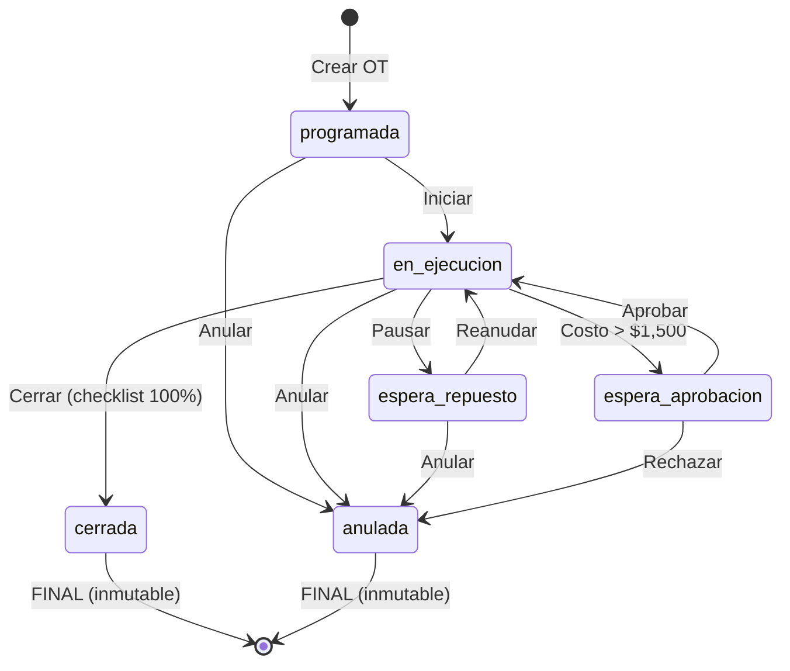

# KESA ERP - Detalle de Orden de Trabajo (OT)
## Especificación Técnica y Arquitectura UX

### **Documento de Diseño Enterprise - Pantalla Crítica**
**Módulo:** Flota  
**Pantalla:** Detalle de Orden de Trabajo (OT)  
**Versión:** 1.0.0  
**Fecha:** 29/12/2024  
**Autor:** Lead UX Architect

---

## 1. RESUMEN EJECUTIVO

La pantalla de **Detalle de Orden de Trabajo** es una de las pantallas más críticas del módulo Flota. Concentra:
- **Gestión completa del ciclo de vida** de una OT (desde creación hasta cierre)
- **Integraciones con 3 módulos** (Inventario, Proveedores, Finanzas)
- **Auditoría total** conforme a RNF-FLOTA-030
- **Validaciones complejas** por estado y rol
- **Flujos críticos** (aprobaciones, cierre, anulación)

Esta pantalla debe ser:
- ✅ **Production-ready** desde el primer sprint
- ✅ **Libre de ambigüedades** para desarrollo
- ✅ **Escalable** para crecimiento futuro
- ✅ **Auditada y trazable** al 100%

---

## 2. CUMPLIMIENTO DE REQUERIMIENTOS SRS

### ✅ **CU-FLOTA-04 – Registrar mantenimiento correctivo**
- **Implementación:** Tab "Diagnóstico" con campos completos
- **Campos obligatorios:**
  - Diagnóstico técnico detallado
  - Causa raíz identificada
  - Solución aplicada
- **Validación:** No se puede cerrar OT sin diagnóstico completo

### ✅ **CU-FLOTA-03 – Generar mantenimiento preventivo automático**
- **Implementación:** Sistema distingue entre preventivo/correctivo
- **Badge de tipo:** Visual diferenciado
- **Checklist específico:** Items según tipo de mantenimiento
- **SLA diferenciado:** Preventivo menos estricto que correctivo

### ✅ **RF-FLOTA-091 – Integración con Inventario (repuestos)**
- **Implementación:** Tab "Repuestos" con tabla completa
- **Funcionalidades:**
  1. **Búsqueda en catálogo:** Input con Search icon conectado a API de Inventario
  2. **Stock en tiempo real:** Columna "Stock" muestra disponibilidad actual
  3. **Estados de repuesto:**
     - `disponible`: Verde, en almacén
     - `reservado`: Azul, asignado a esta OT
     - `consumido`: Gris, ya utilizado y descontado
     - `sin_stock`: Rojo, requiere compra
  4. **Flujo completo:**
     ```
     Buscar → Agregar → Verificar Stock → Reservar → Consumir → Actualizar Inventario
     ```
  5. **Cálculo automático de costos:** Suma de (cantidad × costo unitario)

**Endpoints preparados:**
```typescript
GET /api/inventario/repuestos?search={query}&categoria=flota
POST /api/inventario/repuestos/{id}/reservar
POST /api/inventario/repuestos/{id}/consumir
GET /api/inventario/repuestos/{id}/stock
```

### ✅ **RF-FLOTA-092 – Integración con Proveedores (talleres)**
- **Implementación:** Card "Taller Asignado" con datos completos
- **Funcionalidades:**
  1. **Selector de taller:** Dropdown con talleres internos y externos
  2. **Contacto directo:** Nombre y teléfono del responsable
  3. **Badge de tipo:** Visual diferenciado (Interno/Externo)
  4. **Cambio de taller:** Permitido solo en estados "Programada" y "En Ejecución"
  5. **Auditoría:** Cada cambio queda registrado en timeline

**Endpoints preparados:**
```typescript
GET /api/proveedores?tipo=taller&activo=true
GET /api/proveedores/{id}/detalle
PUT /api/ot/{id}/asignar-taller
```

### ✅ **RF-FLOTA-093 – Integración con Finanzas (costos)**
- **Implementación:** Tab "Costos" con desglose dual (Estimado vs Real)
- **Funcionalidades:**
  1. **Desglose por categoría:**
     - Mano de Obra (MO)
     - Repuestos (REP)
     - Servicios de Terceros (TER)
     - Otros (OTR)
  2. **Cálculo automático:**
     - `costos.repuestosReales` = suma automática de repuestos consumidos
     - `costos.totalReal` = MO + REP + TER + OTR
  3. **Análisis de variación:**
     - Diferencia absoluta: `totalReal - totalEstimado`
     - Diferencia porcentual: `(diferencia / totalEstimado) × 100`
     - Alert si variación > 20%
  4. **Centro de costo:**
     - Selector con opciones:
       - `FLOTA-MANTENIMIENTO-PREVENTIVO`
       - `FLOTA-MANTENIMIENTO-CORRECTIVO`
       - `FLOTA-MANTENIMIENTO-PREDICTIVO`
  5. **Regla de aprobación:**
     - **Si `totalReal` > $1,500 USD:**
       - Cambio automático a estado "Espera Aprobación"
       - Notificación al Gerente
       - Bloqueo de cierre hasta aprobación

**Endpoints preparados:**
```typescript
POST /api/finanzas/asientos-contables (al cerrar OT)
GET /api/finanzas/centros-costo?modulo=flota
POST /api/finanzas/solicitud-aprobacion
```

### ✅ **RNF-FLOTA-030 – Trazabilidad total y auditoría**
- **Implementación:** Tab "Auditoría" con timeline completo
- **Tipos de eventos registrados:**
  1. `creacion`: OT creada
  2. `cambio_estado`: Transición entre estados
  3. `asignacion`: Cambio de taller o mecánico
  4. `diagnostico`: Diagnóstico completado
  5. `trabajo`: Registro de trabajo realizado
  6. `repuesto`: Repuesto agregado/consumido
  7. `costo`: Actualización de costos
  8. `evidencia`: Archivo cargado
  9. `aprobacion`: Solicitud aprobada/rechazada
  10. `cierre`: OT cerrada
  11. `anulacion`: OT anulada

**Datos auditables (cada evento):**
```typescript
{
  fecha: string,           // ISO timestamp
  tipo: string,
  usuario: string,         // Email completo
  descripcion: string,
  estadoAnterior?: string,
  estadoNuevo?: string,
  metadata?: Record<string, any>
}
```

**Footer de auditoría (siempre visible):**
- "Todos los registros son inmutables conforme a RNF-FLOTA-030"
- Total de eventos en timeline
- Protección con icono Shield

---

## 3. ARQUITECTURA DE INFORMACIÓN

### **Estructura Jerárquica**

```
Detalle OT (DetalleOrdenTrabajo.tsx)
│
├── Header Contextual
│   ├── Breadcrumb (navegación)
│   ├── Card Header Principal
│   │   ├── [Izquierda] Info OT + Vehículo
│   │   │   ├── Icono + N° OT
│   │   │   ├── Badges (Estado + Criticidad)
│   │   │   ├── Título de la OT
│   │   │   ├── Datos del vehículo (Placa, Marca, Km)
│   │   │   └── Taller asignado
│   │   ├── [Centro] Indicador SLA
│   │   │   ├── Estado SLA (cumple/en_riesgo/vencido)
│   │   │   ├── Horas transcurridas / Objetivo
│   │   │   └── Progress bar visual
│   │   └── [Derecha] Acciones Contextuales
│   │       ├── Botones según estado actual
│   │       ├── Separador
│   │       └── Info de auditoría resumida
│   └── Alertas Condicionales
│       ├── OT Cerrada (inmutable)
│       └── OT Anulada (motivo)
│
├── Tabs de Navegación (6 tabs)
│   │
│   ├── [1] TAB RESUMEN
│   │   ├── Card: Información General
│   │   │   ├── Descripción inicial
│   │   │   ├── Tipo + Criticidad
│   │   │   ├── Kilometraje
│   │   │   ├── Centro de costo
│   │   │   └── Observaciones (editable)
│   │   ├── Card: Taller Asignado
│   │   │   ├── Icono + Nombre
│   │   │   ├── Badge tipo (Interno/Externo)
│   │   │   ├── Contacto
│   │   │   └── Botón Cambiar (si edición activa)
│   │   └── Card: Checklist de Cierre (solo en ejecución)
│   │       ├── Progress bar
│   │       ├── Lista de items
│   │       │   ├── Checkbox
│   │       │   ├── Texto del item
│   │       │   └── Badge "Obligatorio" (si aplica)
│   │       └── Alert si faltan items
│   │
│   ├── [2] TAB DIAGNÓSTICO
│   │   ├── Card: Diagnóstico Técnico
│   │   │   ├── Campo: Diagnóstico (textarea)
│   │   │   ├── Campo: Causa Raíz (textarea)
│   │   │   ├── Campo: Solución Aplicada (textarea)
│   │   │   └── Botón Guardar (si edición)
│   │   └── Card: Bitácora de Trabajos
│   │       ├── Header con botón "Agregar Registro"
│   │       └── Lista de trabajos
│   │           ├── Fecha + Hora
│   │           ├── Descripción
│   │           ├── Tiempo empleado
│   │           └── Usuario
│   │
│   ├── [3] TAB REPUESTOS (Integración Inventario)
│   │   └── Card: Repuestos Utilizados
│   │       ├── Buscador (si edición)
│   │       ├── Tabla de repuestos
│   │       │   ├── Código Inventario
│   │       │   ├── Nombre
│   │       │   ├── Cantidad
│   │       │   ├── Stock disponible
│   │       │   ├── Estado (badge)
│   │       │   ├── Costo unitario
│   │       │   ├── Total
│   │       │   └── Acción (eliminar, si edición)
│   │       └── Subtotal repuestos
│   │
│   ├── [4] TAB COSTOS (Integración Finanzas)
│   │   ├── Grid 2 columnas
│   │   │   ├── Card: Costos Estimados
│   │   │   │   ├── MO, REP, TER, OTR
│   │   │   │   └── Total Estimado
│   │   │   └── Card: Costos Reales
│   │   │       ├── MO (editable), REP (auto), TER (editable), OTR (editable)
│   │   │       └── Total Real
│   │   └── Card: Análisis de Variación
│   │       ├── Variación absoluta + porcentual
│   │       ├── Alert si > $1,500 (aprobación)
│   │       └── Selector de centro de costo
│   │
│   ├── [5] TAB EVIDENCIAS
│   │   └── Card: Evidencias Fotográficas y Documentos
│   │       ├── Botón "Cargar Archivo" (si edición)
│   │       └── Grid de evidencias
│   │           ├── Tipo (icono + badge)
│   │           ├── Preview (thumbnail)
│   │           ├── Nombre + tamaño
│   │           ├── Fecha subida + usuario
│   │           └── Acciones (Ver, Descargar, Eliminar)
│   │
│   └── [6] TAB AUDITORÍA (RNF-FLOTA-030)
│       └── Card: Timeline de Auditoría
│           ├── Header con Shield icon
│           ├── Lista de eventos
│           │   ├── Icono por tipo
│           │   ├── Descripción
│           │   ├── Badges si cambio de estado
│           │   ├── Metadata (si aplica)
│           │   ├── Fecha + Hora
│           │   └── Usuario
│           └── Footer inmutable
│
└── Dialogs (modales)
    ├── Dialog: Cerrar OT
    │   ├── Alerta de confirmación
    │   ├── Checklist completado
    │   ├── Campo: Kilometraje al cierre
    │   ├── Campo: Notas de cierre *
    │   ├── Resumen de costos finales
    │   └── Botones (Cancelar | Confirmar)
    │
    └── Dialog: Anular OT
        ├── Alerta destructiva
        ├── Campo: Motivo de anulación *
        └── Botones (Cancelar | Confirmar)
```

---

## 4. MATRIZ DE ESTADOS Y ACCIONES

### **Estados Disponibles**
| Estado | Badge | Icono | Descripción |
|--------|-------|-------|-------------|
| **programada** | Outline azul | Clock | Creada, pendiente de inicio |
| **en_ejecucion** | Primary | Wrench | En proceso de ejecución |
| **espera_repuesto** | Secondary amarillo | Package | Pausada, esperando repuesto |
| **espera_aprobacion** | Secondary naranja | ShieldAlert | Requiere aprobación gerencial |
| **cerrada** | Outline verde | CheckCircle | Completada exitosamente |
| **anulada** | Secondary gris | XCircle | Cancelada con motivo |

### **Acciones Contextuales por Estado**

#### **Estado: Programada**
| Acción | Botón | Rol Requerido | Resultado |
|--------|-------|---------------|-----------|
| Iniciar OT | Primary | Mecánico+ | Estado → en_ejecucion |
| Editar | Outline | Gestor+ | Modo edición activado |
| Reprogramar | Outline | Gestor+ | Cambio de fecha programada |
| Anular OT | Destructive | Gestor+ | Estado → anulada (con motivo) |

#### **Estado: En Ejecución**
| Acción | Botón | Rol Requerido | Validación | Resultado |
|--------|-------|---------------|------------|-----------|
| Cerrar OT | Primary | Mecánico+ | Checklist 100% | Dialog cerrar OT |
| Editar | Outline | Mecánico+ | - | Modo edición activado |
| Pausar | Outline | Mecánico+ | - | Estado → espera_repuesto |
| Anular OT | Destructive | Gestor+ | Justificación | Estado → anulada |

#### **Estado: Cerrada**
| Acción | Botón | Rol Requerido | Resultado |
|--------|-------|---------------|-----------|
| Descargar PDF | Outline | Todos | Genera PDF con toda la info |
| Ver Detalles | Outline | Todos | Solo lectura |

### **Transiciones de Estado Válidas**



---

## 5. INDICADOR DE SLA

### **Cálculo del SLA**

**Fórmula:**
```typescript
const horasTranscurridas = (Date.now() - new Date(ot.fechaInicio).getTime()) / (1000 * 60 * 60);
const slaObjetivo = ot.slaObjetivo; // Según criticidad

if (horasTranscurridas <= slaObjetivo * 0.7) {
  slaEstado = 'cumple'; // Verde
} else if (horasTranscurridas <= slaObjetivo) {
  slaEstado = 'en_riesgo'; // Amarillo
} else {
  slaEstado = 'vencido'; // Rojo
}
```

**SLA por Criticidad:**
| Criticidad | SLA Objetivo | Umbral Riesgo | Color |
|-----------|--------------|---------------|-------|
| Baja | 168h (7 días) | 118h (70%) | Azul |
| Media | 72h (3 días) | 50h (70%) | Amarillo |
| Alta | 24h | 17h (70%) | Naranja |
| Crítica | 4h | 3h (70%) | Rojo |

**Visualización:**
- **Card destacado** en header con fondo muted
- **Icono** según estado (CheckCircle, AlertTriangle, XCircle)
- **Progress bar** visual
- **Texto:** "X.Xh / Yh objetivo"
- **Fecha programada** al lado derecho

---

## 6. CHECKLIST DE CIERRE (CRÍTICO)

### **Items del Checklist**

```typescript
checklistCierre: [
  {
    id: 'CHK-001',
    item: 'Prueba de frenado realizada',
    obligatorio: true,
    completado: false
  },
  {
    id: 'CHK-002',
    item: 'Niveles de líquidos verificados',
    obligatorio: true,
    completado: false
  },
  {
    id: 'CHK-003',
    item: 'Evidencias fotográficas adjuntas',
    obligatorio: true,
    completado: false
  },
  {
    id: 'CHK-004',
    item: 'Repuestos consumidos registrados',
    obligatorio: true,
    completado: false
  },
  {
    id: 'CHK-005',
    item: 'Costos reales actualizados',
    obligatorio: true,
    completado: false
  },
  {
    id: 'CHK-006',
    item: 'Vehículo limpio y listo para servicio',
    obligatorio: false,
    completado: false
  }
]
```

### **Validación**

**Regla de negocio:**
- **NO se puede cerrar la OT si:**
  - Hay items obligatorios sin completar
  - No hay diagnóstico técnico
  - No hay solución aplicada
  - Costos reales = 0

**Función de validación:**
```typescript
const puedeAbrirCerrarOT = () => {
  return ot.checklistCierre.every(item => 
    !item.obligatorio || item.completado
  );
};
```

**UI:**
- Botón "Cerrar OT" deshabilitado si validación falla
- Alert visible si faltan items
- Progress bar del checklist

---

## 7. MODO EDICIÓN

### **Activación del Modo Edición**

**Botón:** "Editar" (outline, icono Edit)  
**Estados permitidos:** programada, en_ejecucion  
**Rol requerido:** Mecánico+ (para en_ejecucion), Gestor+ (para programada)

### **Campos Editables por Tab**

#### **Tab Resumen**
- ✅ Observaciones (textarea)
- ✅ Cambiar taller (botón)

#### **Tab Diagnóstico**
- ✅ Diagnóstico técnico (textarea)
- ✅ Causa raíz (textarea)
- ✅ Solución aplicada (textarea)
- ✅ Agregar registro de trabajo (botón + form)

#### **Tab Repuestos**
- ✅ Agregar repuesto (buscador + tabla)
- ✅ Eliminar repuesto (botón trash)
- ✅ Modificar cantidad (input number)

#### **Tab Costos**
- ✅ Mano de obra real (input number)
- ✅ Terceros reales (input number)
- ✅ Otros reales (input number)
- ✅ Centro de costo (select)
- ❌ Repuestos reales (automático, no editable)

#### **Tab Evidencias**
- ✅ Cargar archivo (botón upload)
- ✅ Eliminar evidencia (botón trash)

#### **Tab Auditoría**
- ❌ Solo lectura (inmutable)

### **Guardar Cambios**

**Opción 1: Guardar por tab**
- Botón "Guardar" al final de cada sección editable
- Guarda solo cambios de ese tab
- Feedback visual: Toast de confirmación

**Opción 2: Guardar global**
- Botón "Guardar Cambios" en modo edición (botón flotante)
- Guarda todos los cambios de todos los tabs
- Dialog de confirmación si hay cambios críticos

---

## 8. DIALOGS (MODALES CRÍTICOS)

### **Dialog: Cerrar OT**

**Trigger:** Botón "Cerrar OT" (solo si checklist 100%)  
**Tamaño:** max-w-2xl  
**Bloqueo:** Modal bloqueante (backdrop)

**Contenido:**
1. **Header:**
   - Icono CheckCircle verde
   - Título: "Cerrar Orden de Trabajo"
   - Descripción: "Esta acción es irreversible. Una vez cerrada la OT, no se podrán realizar más modificaciones."

2. **Alert:** Checklist completado (X de Y items)

3. **Campos obligatorios:**
   - **Kilometraje al cierre** (input number)
     - Validación: Debe ser >= kilometraje de registro
   - **Notas de cierre** (textarea)
     - Validación: Mínimo 20 caracteres

4. **Resumen de costos finales:**
   - Card con fondo muted
   - Desglose: MO, Repuestos, Total
   - Destaque del total en bold

5. **Footer:**
   - Botón "Cancelar" (outline)
   - Botón "Confirmar Cierre de OT" (primary, con icono CheckCircle)

**Flujo al confirmar:**
```typescript
1. Validar campos obligatorios
2. Validar checklist 100%
3. Actualizar estado a "cerrada"
4. Registrar en timeline:
   - tipo: 'cierre'
   - usuario: usuario actual
   - fecha: Date.now()
5. Actualizar auditoria.cerradoPor y auditoria.cerradoEn
6. Generar asiento contable (integración Finanzas)
7. Liberar repuestos no consumidos (integración Inventario)
8. Notificar a Gestor de Flota (email)
9. Actualizar estado del vehículo
10. Cerrar modal y recargar vista (ahora inmutable)
```

### **Dialog: Anular OT**

**Trigger:** Botón "Anular OT" (destructive)  
**Tamaño:** max-w-lg  
**Bloqueo:** Modal bloqueante

**Contenido:**
1. **Header:**
   - Icono XCircle rojo
   - Título: "Anular Orden de Trabajo"
   - Descripción: "La OT no será eliminada, pero quedará marcada como anulada en el sistema."

2. **Alert destructivo:**
   - "Esta acción es irreversible y quedará registrada en la auditoría."

3. **Campo obligatorio:**
   - **Motivo de anulación** (textarea)
     - Validación: Mínimo 30 caracteres
     - Placeholder: "Describir el motivo por el cual se anula esta OT..."

4. **Footer:**
   - Botón "Cancelar" (outline)
   - Botón "Confirmar Anulación" (destructive, con icono XCircle)

**Flujo al confirmar:**
```typescript
1. Validar motivo (mínimo 30 caracteres)
2. Actualizar estado a "anulada"
3. Registrar en timeline:
   - tipo: 'anulacion'
   - usuario: usuario actual
   - fecha: Date.now()
   - descripcion: motivo
4. Actualizar auditoria.anuladoPor, anuladoEn, motivoAnulacion
5. Liberar repuestos reservados (integración Inventario)
6. Notificar a creador de la OT (email)
7. Cerrar modal y recargar vista (ahora inmutable)
```

---

## 9. EVIDENCIAS Y DOCUMENTOS

### **Tipos de Evidencia**

```typescript
type TipoEvidencia = 
  | 'foto_antes'      // Foto del problema/desgaste antes de reparar
  | 'foto_despues'    // Foto del resultado final
  | 'documento'       // PDF general
  | 'factura'         // Factura de proveedor
  | 'informe';        // Informe técnico detallado
```

### **Estructura de Evidencia**

```typescript
interface Evidencia {
  id: string;
  tipo: TipoEvidencia;
  nombre: string;           // Nombre del archivo
  url: string;              // URL de almacenamiento (S3, Azure Blob, etc.)
  tamano: number;           // Tamaño en bytes
  mimeType: string;         // 'image/jpeg', 'application/pdf', etc.
  fechaSubida: string;      // ISO timestamp
  subioPor: string;         // Email del usuario
}
```

### **Grid de Evidencias**

**Layout:** Grid de 3 columnas (desktop), 2 (tablet), 1 (mobile)  
**Card por evidencia:**
- **Header:** Icono + Badge tipo + Botón eliminar (si edición)
- **Preview:**
  - Si imagen: Thumbnail con aspect-ratio 16:9
  - Si documento: Icono FileText con fondo muted
- **Footer:**
  - Nombre (truncado)
  - Tamaño en MB
  - Fecha de subida
  - Botones: Ver | Descargar

### **Upload de Archivo**

**Botón:** "Cargar Archivo" (primary, icono Upload)  
**Tipos permitidos:**
- Imágenes: .jpg, .jpeg, .png, .webp
- Documentos: .pdf, .doc, .docx, .xls, .xlsx

**Tamaño máximo:** 10 MB por archivo

**Flujo de upload:**
```typescript
1. Usuario selecciona archivo(s)
2. Validar tipo y tamaño
3. Mostrar preview + progress bar
4. Upload a storage (presigned URL)
5. Crear registro en BD
6. Agregar a array ot.evidencias
7. Registrar en timeline
8. Actualizar UI
```

---

## 10. INTEGRACIÓN CON MÓDULOS

### **10.1 Inventario (Repuestos) - RF-FLOTA-091**

**Endpoints:**

```typescript
// Buscar repuestos
GET /api/inventario/repuestos?search={query}&categoria=flota
Response: Array<{
  id: string,
  codigo: string,
  nombre: string,
  stockDisponible: number,
  costoUnitario: number,
  categoria: string
}>

// Reservar repuesto
POST /api/inventario/repuestos/{id}/reservar
Body: {
  otId: string,
  cantidad: number
}
Response: {
  success: boolean,
  stockRestante: number
}

// Consumir repuesto
POST /api/inventario/repuestos/{id}/consumir
Body: {
  otId: string,
  cantidad: number
}
Response: {
  success: boolean,
  stockRestante: number,
  costoTotal: number
}

// Liberar repuesto (si OT se anula)
POST /api/inventario/repuestos/{id}/liberar
Body: {
  otId: string,
  cantidad: number
}
```

**Flujo completo:**

1. **Agregar repuesto:**
   - Usuario busca en catálogo
   - Selecciona repuesto
   - Ingresa cantidad
   - Sistema verifica stock disponible
   - Si hay stock: Estado → `disponible`
   - Si no hay stock: Estado → `sin_stock`, OT → `espera_repuesto`

2. **Reservar repuesto:**
   - Al cambiar OT a estado `en_ejecucion`
   - Llamar endpoint `/reservar`
   - Estado del repuesto → `reservado`
   - Stock se decrementa (pero no se descuenta aún)

3. **Consumir repuesto:**
   - Usuario marca repuesto como consumido
   - Llamar endpoint `/consumir`
   - Estado del repuesto → `consumido`
   - Stock se descuenta definitivamente
   - Costo se suma a `costos.repuestosReales`

4. **Liberar repuesto:**
   - Si OT se anula antes de consumir
   - Llamar endpoint `/liberar`
   - Stock se restaura
   - Estado del repuesto se elimina de la OT

### **10.2 Proveedores (Talleres) - RF-FLOTA-092**

**Endpoints:**

```typescript
// Listar talleres activos
GET /api/proveedores?tipo=taller&activo=true
Response: Array<{
  id: string,
  nombre: string,
  tipo: 'interno' | 'externo',
  contacto: string | null,
  telefono: string | null,
  email: string | null
}>

// Asignar taller a OT
PUT /api/ot/{otId}/asignar-taller
Body: {
  tallerId: string
}
Response: {
  success: boolean,
  taller: Taller
}

// Historial de OTs del taller
GET /api/proveedores/{id}/historial-ots
Response: Array<{
  otId: string,
  fechaAsignacion: string,
  fechaCierre: string | null,
  slaCumplido: boolean,
  costoTotal: number
}>
```

**Flujo de asignación:**

1. Usuario hace clic en "Cambiar Taller"
2. Se abre selector con lista de talleres
3. Usuario selecciona nuevo taller
4. Sistema valida que taller esté activo
5. Llamar endpoint `/asignar-taller`
6. Actualizar `ot.taller`
7. Registrar en timeline tipo `asignacion`
8. Si taller externo: Enviar email de notificación

### **10.3 Finanzas (Costos) - RF-FLOTA-093**

**Endpoints:**

```typescript
// Crear asiento contable (al cerrar OT)
POST /api/finanzas/asientos-contables
Body: {
  fecha: string,
  tipo: 'gasto',
  centroCosto: string,
  cuentaDebito: string,  // GASTO-FLOTA-MANTENIMIENTO
  cuentaCredito: string, // CAJA o CUENTAS-POR-PAGAR
  monto: number,
  referencia: string,    // Número de OT
  descripcion: string,
  desglose: {
    manoObra: number,
    repuestos: number,
    terceros: number,
    otros: number
  }
}
Response: {
  success: boolean,
  asientoId: string
}

// Solicitar aprobación (si costo > umbral)
POST /api/finanzas/solicitud-aprobacion
Body: {
  otId: string,
  costoEstimado: number,
  costoReal: number,
  motivo: string,
  solicitadoPor: string
}
Response: {
  success: boolean,
  aprobacionId: string
}

// Aprobar/Rechazar
PUT /api/finanzas/aprobacion/{id}
Body: {
  accion: 'aprobar' | 'rechazar',
  aprobadoPor: string,
  comentarios: string | null
}
Response: {
  success: boolean,
  otNuevoEstado: string
}
```

**Flujo de costos:**

1. **Al crear OT:**
   - Usuario ingresa costos estimados
   - Se almacenan en `costos.{categoria}Estimada`

2. **Durante ejecución:**
   - Costos reales se actualizan:
     - `manoObraReal`: Manual
     - `repuestosReales`: Automático (suma de repuestos consumidos)
     - `tercerosReales`: Manual
     - `otrosReales`: Manual
   - `totalReal` se calcula automáticamente

3. **Validación de umbral:**
   ```typescript
   if (costos.totalReal > 1500) {
     ot.estado = 'espera_aprobacion';
     // Crear solicitud de aprobación
     POST /api/finanzas/solicitud-aprobacion
     // Notificar a Gerente
   }
   ```

4. **Al cerrar OT:**
   - Validar que `totalReal > 0`
   - Crear asiento contable automático
   - Generar comprobante
   - Registrar en timeline

---

## 11. RESPONSIVE DESIGN

### **Breakpoints**

```css
/* Mobile */
@media (max-width: 767px) {
  - Header: Column layout
  - Acciones: Full width, vertical
  - Tabs: Scrollable horizontal
  - Grids: 1 columna
  - Tabla repuestos: Cards en lugar de tabla
}

/* Tablet */
@media (min-width: 768px) and (max-width: 1023px) {
  - Header: 2 columnas
  - Grids: 2 columnas
  - Tabla: Scroll horizontal
}

/* Desktop */
@media (min-width: 1024px) {
  - Layout completo
  - Grids: 2-3 columnas
  - Tabla: Full width
}
```

### **Ajustes Mobile**

1. **Header:**
   - Icono + N° OT apilados verticalmente
   - Badges en fila
   - SLA en card separado
   - Acciones en lista vertical

2. **Tabs:**
   - Scrollable horizontal con flechas
   - Badges de contador más pequeños

3. **Repuestos:**
   - Tabla → Cards verticales
   - 1 card por repuesto

4. **Evidencias:**
   - Grid 1 columna
   - Preview más grande

---

## 12. ACCESIBILIDAD (WCAG AA)

### ✅ **Contraste de Color**
- Badges: Mínimo 4.5:1
- Estados críticos: Doble indicador (color + icono)
- Textos: 7:1 (principal), 4.5:1 (secundario)

### ✅ **Navegación por Teclado**
- Tabs: Arrow keys
- Checkboxes: Space
- Botones: Enter
- Modales: Esc para cerrar
- Trap focus en modales abiertos

### ✅ **Lectores de Pantalla**
- ARIA labels en todos los botones de acción
- ARIA live regions para cambios dinámicos
- Role="alert" para validaciones
- Descripción de estados en badges

### ✅ **Focus Management**
- Focus visible en todos los elementos interactivos
- Focus automático en campo principal al abrir modal
- Retorno de focus al cerrar modal

---

## 13. VALIDACIONES Y ESTADOS EMPTY/LOADING/ERROR

### **Estados de UI**

#### **Loading (Cargando OT)**
```tsx
<div className="flex items-center justify-center py-12">
  <Loader2 className="size-8 animate-spin text-primary" />
  <p className="ml-3 text-muted-foreground">Cargando detalle de OT...</p>
</div>
```

#### **Error (OT no encontrada)**
```tsx
<Alert variant="destructive">
  <AlertCircle className="size-4" />
  <AlertDescription>
    <strong>Error:</strong> No se pudo cargar la orden de trabajo.
    La OT {otId} no existe o no tienes permisos para verla.
  </AlertDescription>
</Alert>
<Button variant="outline" onClick={volverAtras}>
  <ArrowLeft className="size-4 mr-2" />
  Volver a Lista
</Button>
```

#### **Empty States**

**Sin trabajos realizados:**
```tsx
<div className="text-center py-8 text-muted-foreground">
  <Wrench className="size-12 mx-auto mb-2 opacity-50" />
  <p>No hay trabajos registrados</p>
  {modoEdicion && (
    <Button className="mt-4">Agregar Primer Registro</Button>
  )}
</div>
```

**Sin repuestos:**
```tsx
<div className="text-center py-8 text-muted-foreground">
  <Package className="size-12 mx-auto mb-2 opacity-50" />
  <p>No hay repuestos agregados</p>
  {modoEdicion && (
    <Button className="mt-4">Buscar Repuesto</Button>
  )}
</div>
```

**Sin evidencias:**
```tsx
<div className="col-span-full text-center py-12 text-muted-foreground">
  <Image className="size-16 mx-auto mb-4 opacity-50" />
  <p>No hay evidencias cargadas</p>
  {modoEdicion && (
    <Button className="mt-4" variant="outline">
      <Upload className="size-4 mr-2" />
      Cargar Primera Evidencia
    </Button>
  )}
</div>
```

### **Validaciones por Campo**

| Campo | Validación | Mensaje de Error |
|-------|-----------|------------------|
| Diagnóstico técnico | Mínimo 50 caracteres | "El diagnóstico debe tener al menos 50 caracteres" |
| Causa raíz | Mínimo 30 caracteres | "Describe la causa raíz con al menos 30 caracteres" |
| Solución aplicada | Mínimo 30 caracteres | "Describe la solución con al menos 30 caracteres" |
| Kilometraje cierre | >= kilometraje registro | "El kilometraje al cierre no puede ser menor al de registro" |
| Notas de cierre | Mínimo 20 caracteres | "Las notas de cierre deben tener al menos 20 caracteres" |
| Motivo anulación | Mínimo 30 caracteres | "El motivo debe tener al menos 30 caracteres" |
| Mano de obra real | > 0 | "La mano de obra debe ser mayor a 0" |
| Cantidad repuesto | > 0 y <= stock | "Cantidad inválida o sin stock suficiente" |

---

## 14. PERFORMANCE Y OPTIMIZACIONES

### **Lazy Loading**
- Tabs se cargan al hacer clic (React.lazy)
- Imágenes con loading="lazy"
- Timeline virtualizado si > 100 eventos

### **Memoización**
```typescript
const memoizedTimeline = useMemo(() => 
  ot.timeline.map(renderTimelineEvent), 
  [ot.timeline]
);

const memoizedCostosTotal = useMemo(() => 
  calculateTotalReal(ot.costos), 
  [ot.costos]
);
```

### **Debouncing**
- Búsqueda de repuestos: 300ms
- Auto-guardado de campos: 1000ms

---

## 15. ROADMAP DE DESARROLLO

### **Sprint 1 (Actual): Core Functionality** ✅
- [x] Data model completo
- [x] Header con contexto y SLA
- [x] 6 tabs de navegación
- [x] Tab Resumen con checklist
- [x] Tab Diagnóstico con bitácora
- [x] Tab Repuestos con tabla
- [x] Tab Costos con desglose
- [x] Tab Evidencias con grid
- [x] Tab Auditoría con timeline
- [x] Dialog cerrar OT
- [x] Dialog anular OT
- [x] Modo edición
- [x] Validaciones y estados

### **Sprint 2: Integraciones**
- [ ] Conectar con API de Inventario
- [ ] Buscador de repuestos funcional
- [ ] Reserva y consumo de stock
- [ ] Conectar con API de Proveedores
- [ ] Selector de talleres funcional
- [ ] Conectar con API de Finanzas
- [ ] Creación de asientos contables
- [ ] Sistema de aprobaciones

### **Sprint 3: Funcionalidades Avanzadas**
- [ ] Upload real de archivos (S3/Azure)
- [ ] Visor de imágenes (lightbox)
- [ ] Visor de PDFs inline
- [ ] Auto-guardado (draft)
- [ ] Notificaciones en tiempo real
- [ ] Firma digital de cierre
- [ ] Generación de PDF completo

### **Sprint 4: Optimizaciones**
- [ ] Timeline virtualizado
- [ ] Caché de datos
- [ ] Offline mode (PWA)
- [ ] Websockets para cambios en tiempo real
- [ ] Analítica de uso

---

**Fin de la especificación técnica**  
**Pantalla crítica lista para implementación en producción** ✅

